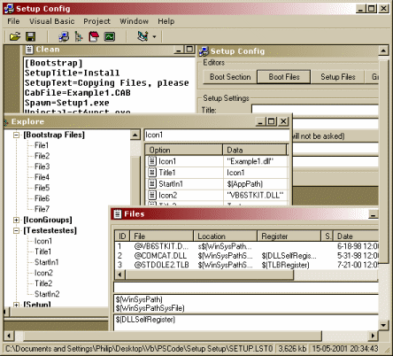



## Setup Config

### Description

This is not an install creator, but editor 

----

This will edit the setup program created by "Package & Deployment Wizard", that follows with VB (I think will all versions). 

----

What it does is it edits the setup.lst file, that controls the whole setup process. There is a few functions that you can't do in the standard setup creator. 

----

There are still some functions that don't work, but I will keep on updating. It's mainly just functions I haven't typed in yet, nothing hard to do, I just need to type then in.
 
### More Info
 

             |
---                |---
**Submitted On**   |2001-05-30 18:15:52
**By**             |[Philip Birk\-Jensen](https://github.com/Planet-Source-Code/PSCIndex/blob/master/ByAuthor/philip-birk-jensen.md)
**Level**          |Intermediate
**User Rating**    |4.5 (18 globes from 4 users)
**Compatibility**  |VB 5\.0, VB 6\.0
**Category**       |[Complete Applications](https://github.com/Planet-Source-Code/PSCIndex/blob/master/ByCategory/complete-applications__1-27.md)
**World**          |[Visual Basic](https://github.com/Planet-Source-Code/PSCIndex/blob/master/ByWorld/visual-basic.md)
**Archive File**   |[Setup Conf202815302001\.zip](https://github.com/Planet-Source-Code/philip-birk-jensen-setup-config__1-23592/archive/master.zip)

